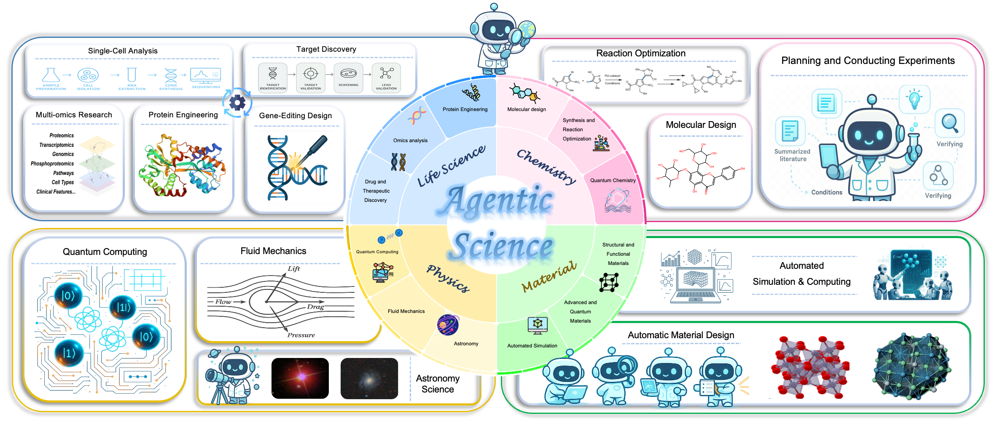

# From AI for Science to Agentic Science 🤖️

[](https://arxiv.org/)  
[](https://example.com/citations)  
[![License: MIT]](https://opensource.org/licenses/MIT)


---

🔥 **News**

Stay tuned for the latest updates in AI research!

Welcome to the Repo maintained by 🌟 Yuejin Yang & Jiaqi Wei & Xiang Zhang 🌟 ~

This repository highlights how AI is becoming a **creative partner**, accelerating and reshaping scientific discovery.

Explore this **focused, detailed repository** to understand how autonomous agents are revolutionizing science!

🔔🔔🔔 Please refer to [our paper](https://agenticscience.github.io/) for more detailed information ～

## 👋 Introduction 

**Agentic Science** represents a groundbreaking shift where AI evolves from a tool to an **autonomous agent**, capable of **reasoning, planning, conducting experiments, and refining ideas** independently.
This repository presents the **first comprehensive framework** for Agentic Science, focusing on:

Five Key Abilities of Scientific Agents:
1. **Planning and reasoning**
2. **Tool use and integration**
3. **Memory mechanism**
4. **Collaboration with other agents**
5. **Optimization and evolution**

Four-Step Discovery Cycle:
1. **Observation and hypothesis generation**
2. **Experimental planning and execution**
3. **Result analysis**
4. **Evolution**

We provide a **detailed review** of advancements across **life sciences, chemistry, materials science, and physics**, covering dozens of subfields and hundreds of studies.


*Figure 1: Caption describing the main areas.*


## Part 0: Fully Autonomous Research Pipeline

- **SciMaster: Towards General-Purpose Scientific AI Agents, Part I. X-Master as Foundation: Can We Lead on Humanity's Last Exam?**  
  *Jingyi Chai, Shuo Tang, Rui Ye, Yuwen Du, Xinyu Zhu, Mengcheng Zhou, Yanfeng Wang, Siheng Chen, et al. arXiv 2025*

- **NovelSeek: When Agent Becomes the Scientist--Building Closed-Loop System from Hypothesis to Verification**  
  *NovelSeek Team, Bo Zhang, Shiyang Feng, Xiangchao Yan, Jiakang Yuan, Zhiyin Yu, Xiaohan He, Songtao Huang, et al. arXiv 2025*

- **Large language models for automated open-domain scientific hypotheses discovery**  
  *Zonglin Yang, Xinya Du, Junxian Li, Jie Zheng, Soujanya Poria, Erik Cambria. arXiv 2023*

- **Maps: A multi-agent framework based on big seven personality and socratic guidance for multimodal scientific problem solving**  
  *Jian Zhang, Zhiyuan Wang, Zhangqi Wang, Xinyu Zhang, Fangzhi Xu, Qika Lin, Rui Mao, Erik Cambria, Jun Liu. arXiv 2025*

- **Agentrxiv: Towards collaborative autonomous research**  
  *Samuel Schmidgall, Michael Moor. arXiv 2025*

- **Dolphin: Closed-loop open-ended auto-research through thinking, practice, and feedback**  
  *Jiakang Yuan, Xiangchao Yan, Botian Shi, Tao Chen, Wanli Ouyang, Bo Zhang, Lei Bai, Yu Qiao, Bowen Zhou. arXiv 2025*

- **Towards an AI co-scientist**  
  *Juraj Gottweis, Wei-Hung Weng, Alexander Daryin, Tao Tu, Anil Palepu, Petar Sirkovic, Artiom Myaskovsky, Felix Weissenberger, Keran Rong, Ryutaro Tanno, et al. arXiv 2025*

- **The AI scientist: Towards fully automated open-ended scientific discovery**  
  *Chris Lu, Cong Lu, Robert Tjarko Lange, Jakob Foerster, Jeff Clune, David Ha. arXiv 2024*

- **The virtual lab: AI agents design new SARS-CoV-2 nanobodies with experimental validation**  
  *Kyle Swanson, Wesley Wu, Nash L. Bulaong, John E. Pak, James Zou. bioRxiv 2024*

- **SpatialAgent: An autonomous AI agent for spatial biology**  
  *Hanchen Wang, Yichun He, Paula P. Coelho, Matthew Bucci, Abbas Nazir, Bob Chen, Linh Trinh, Serena Zhang, Kexin Huang, Vineethkrishna Chandrasekar, et al. bioRxiv 2025*

- **Biomni: A general-purpose biomedical AI agent**  
  *Kexin Huang, Serena Zhang, Hanchen Wang, Yuanhao Qu, Yingzhou Lu, Yusuf Roohani, Ryan Li, Lin Qiu, Gavin Li, Junze Zhang, et al. bioRxiv 2025*

- **Automating exploratory proteomics research via language models**  
  *Ning Ding, Shang Qu, Linhai Xie, Yifei Li, Zaoqu Liu, Kaiyan Zhang, Yibai Xiong, Yuxin Zuo, Zhangren Chen, Ermo Hua, et al. arXiv 2024*

- **Matpilot: An LLM-enabled AI materials scientist under the framework of human-machine collaboration**  
  *Ziqi Ni, Yahao Li, Kaijia Hu, Kunyuan Han, Ming Xu, Xingyu Chen, Fengqi Liu, Yicong Ye, Shuxin Bai. arXiv 2024*

- **Tora: A tool-integrated reasoning agent for mathematical problem solving**  
  *Zhibin Gou, Zhihong Shao, Yeyun Gong, Yelong Shen, Yujiu Yang, Minlie Huang, Nan Duan, Weizhu Chen. arXiv 2023*

- **STELLA: Self-Evolving LLM Agent for Biomedical Research**  
  *Ruofan Jin, Zaixi Zhang, Mengdi Wang, Le Cong. arXiv 2025*

- **Two heads are better than one: A multi-agent system has the potential to improve scientific idea generation**  
  *Haoyang Su, Renqi Chen, Shixiang Tang, Xinzhe Zheng, Jinzhe Li, Zhenfei Yin, Wanli Ouyang, Nanqing Dong. arXiv 2024*

- **Dora AI scientist: Multi-agent virtual research team for scientific exploration discovery and automated report generation**  
  *Vladimir Naumov, Diana Zagirova, Sha Lin, Yupeng Xie, Wenhao Gou, Anatoly Urban, Nina Tikhonova, Khadija Alawi, Mike Durymanov, Fedor Galkin, et al. bioRxiv 2025*

- **DiscoveryWorld: A virtual environment for developing and evaluating automated scientific discovery agents**  
  *Peter Jansen, Marc-Alexandre Côté, Tushar Khot, Erin Bransom, Bhavana Dalvi Mishra, Bodhisattwa Prasad Majumder, Oyvind Tafjord, Peter Clark. NeurIPS 2024*

- **Autonomous chemical research with large language models**  
  *Daniil A. Boiko, Robert MacKnight, Ben Kline, Gabe Gomes. Nature 2023*

- **ResearchAgent: Iterative research idea generation over scientific literature with large language models**  
  *Jinheon Baek, Sujay Kumar Jauhar, Silviu Cucerzan, Sung Ju Hwang. arXiv 2024*

- **Agent laboratory: Using LLM agents as research assistants**  
  *Samuel Schmidgall, Yusheng Su, Ze Wang, Ximeng Sun, Jialian Wu, Xiaodong Yu, Jiang Liu, Michael Moor, Zicheng Liu, Emad Barsoum. arXiv 2025*

- **Agent hospital: A simulacrum of hospital with evolvable medical agents**  
  *Junkai Li, Yunghwei Lai, Weitao Li, Jingyi Ren, Meng Zhang, Xinhui Kang, Siyu Wang, Peng Li, Ya-Qin Zhang, Weizhi Ma, et al. arXiv 2024*

- **Conversational health agents: A personalized LLM-powered agent framework**  
  *Mahyar Abbasian, Iman Azimi, Amir M. Rahmani, Ramesh Jain. arXiv 2023*

- **An automatic end-to-end chemical synthesis development platform powered by large language models**  
  *Yixiang Ruan, Chenyin Lu, Ning Xu, Yuchen He, Yixin Chen, Jian Zhang, Jun Xuan, Jianzhang Pan, Qun Fang, Hanyu Gao, et al. Nature Communications 2024*

- **AlphaEvolve: A coding agent for scientific and algorithmic discovery**  
  *Alexander Novikov, Ngân Vũ, Marvin Eisenberger, Emilien Dupont, Po-Sen Huang, Adam Zsolt Wagner, Sergey Shirobokov, Borislav Kozlovskii, Francisco JR Ruiz, Abbas Mehrabian, et al. arXiv 2025*

- **Accelerated end-to-end chemical synthesis development with large language models**  
  *Yixiang Ruan, Chenyin Lu, Ning Xu, Jian Zhang, Jun Xuan, Jianzhang Pan, Qun Fang, Hanyu Gao, Xiaodong Shen, Ning Ye, et al. arXiv 2024*

## Part 1: Agentic Life Science Research

### General Frameworks and Methodologies
- **Biomni: A General-Purpose Biomedical AI Agent**  
  *Kexin Huang, Serena Zhang, Hanchen Wang, Yuanhao Qu, Yingzhou Lu, Yusuf Roohani, Ryan Li, Lin Qiu, Junze Zhang, Di Yin, et al. bioRxiv 2025*

- **STELLA: Self-Evolving LLM Agent for Biomedical Research**  
  *Ruofan Jin, Zaixi Zhang, Mengdi Wang, Le Cong. arXiv 2025*

- **From Intention to Implementation: Automating Biomedical Research via LLMs**  
  *Yi Luo, Linghang Shi, Yihao Li, Aobo Zhuang, Yeyun Gong, Ling Liu, Chen Lin. Science China Information Sciences 2025*

- **PiFlow: Principle-aware Scientific Discovery with Multi-Agent Collaboration**  
  *Yingming Pu, Tao Lin, Hongyu Chen. arXiv 2025*

- **Empowering Biomedical Discovery with AI Agents**  
  *Shanghua Gao, Ada Fang, Yepeng Huang, Valentina Giunchiglia, Ayush Noori, Jonathan Richard Schwarz, Yasha Ektefaie, Jovana Kondic, Marinka Zitnik. Cell 2024*


### Genomics, Transcriptomics and Multi-Omics Analysis
- **GeneAgent: Self-verification Language Agent for Gene Set Knowledge Discovery using Domain Databases**  
  *Zhizheng Wang, Qiao Jin, Chih-Hsuan Wei, Shubo Tian, et al. arXiv 2024*
- **BioInformatics Agent (BIA): Unleashing the Power of Large Language Models to Reshape Bioinformatics Workflow**  
  *Qi Xin, Quyu Kong, Hongyi Ji, Yue Shen, Yuqi Liu, Yan Sun, Zhilin Zhang, Zhaorong Li, Xunlong Xia, Bing Deng, et al. bioRxiv 2024*

- **CellAgent: An LLM-driven Multi-Agent Framework for Automated Single-cell Data Analysis**  
  *Yihang Xiao, Jinyi Liu, Yan Zheng, Xiaohan Xie, Jianye Hao, Mingzhi Li, Ruitao Wang, Fei Ni, Yuxiao Li, Jintian Luo, et al. bioRxiv 2024*

- **Toward a Team of AI-Made Scientists for Scientific Discovery from Gene Expression Data**  
  *Haoyang Liu, Yijiang Li, Jinglin Jian, Yuxuan Cheng, Jianrong Lu, Shuyi Guo, Jinglei Zhu, Mianchen Zhang, Miantong Zhang, Haohan Wang. arXiv 2024*

- **CRISPR-GPT: An LLM Agent for Automated Design of Gene-Editing Experiments**  
  *Kaixuan Huang, Yuanhao Qu, Henry Cousins, William A. Johnson, Di Yin, Mihir Shah, Denny Zhou, Russ Altman, Mengdi Wang, Le Cong. arXiv 2024*

- **SpatialAgent: An Autonomous AI Agent for Spatial Biology**  
  *Hanchen Wang, Yichun He, Paula P. Coelho, Matthew Bucci, Abbas Nazir, Bob Chen, Linh Trinh, Serena Zhang, Kexin Huang, Vineethkrishna Chandrasekar, et al. bioRxiv 2025*

- **PhenoGraph: A Multi-Agent Framework for Phenotype-Driven Discovery in Spatial Transcriptomics Data Augmented with Knowledge Graphs**  
  *Seyednami Niyakan, Xiaoning Qian. bioRxiv 2025*

- **BioAgents: Democratizing Bioinformatics Analysis with Multi-Agent Systems**  
  *Nikita Mehandru, Amanda K. Hall, Olesya Melnichenko, Yulia Dubinina, Daniel Tsirulnikov, David Bamman, Ahmed Alaa, Scott Saponas, Venkat S. Malladi. arXiv 2025*

- **BioMaster: Multi-Agent System for Automated Bioinformatics Analysis Workflow**  
  *Houcheng Su, Weicai Long, Yanlin Zhang. bioRxiv 2025*

- **TransAgent: Dynamizing Transcriptional Regulation Analysis via Multi-Omics-Aware AI Agent**  
  *Guorui Zhang, Chao Song, Liyuan Liu, Qiuyu Wang, Chunquan Li. bioRxiv 2025*

- **CompBioAgent: An LLM-Powered Agent for Single-Cell RNA-Seq Data Exploration**  
  *Haotian Zhang, Yu H. Sun, Wenxing Hu, Xu Cui, Zhengyu Ouyang, Derrick Cheng, Xinmin Zhang, Baohong Zhang. bioRxiv 2025*

- **PerTurboAgent: A Self-Planning Agent for Boosting Sequential Perturb-seq Experiments**  
  *Minsheng Hao, Yongju Lee, Hanchen Wang, Gabriele Scalia, Aviv Regev. bioRxiv 2025*

- **PROTEUS: Automating Exploratory Multiomics Research via Language Models**  
  *Ning Ding, Shang Qu, Linhai Xie, Yifei Li, Zaoqu Liu, Kaiyan Zhang, Yibai Xiong, Yuxin Zuo, Zhangren Chen, Ermo Hua, et al. arXiv 2024/2025*

- **CellVoyager: AI CompBio Agent Generates New Insights by Autonomously Analyzing Biological Data**  
  *Samuel Alber, Bowen Chen, Eric Sun, Alina Isakova, Aaron James Wilk, James Zou. bioRxiv 2025*

- **AstroAgents: A Multi-Agent AI for Hypothesis Generation from Mass Spectrometry Data**  
  *Daniel Saeedi, Denise Buckner, Jose C. Aponte, Amirali Aghazadeh. arXiv 2025*

- **BioDiscoveryAgent: An AI Agent for Designing Genetic Perturbation Experiments**  
  *Yusuf Roohani, Andrew Lee, Qian Huang, Jian Vora, Zachary Steinhart, Kexin Huang, Alexander Marson, Percy Liang, Jure Leskovec. arXiv 2024*
  

### Protein Science and Engineering
- **ProtAgents: Protein Discovery via Large Language Model Multi-Agent Collaborations Combining Physics and Machine Learning**  
  *Alireza Ghafarollahi, Markus J. Buehler. Digital Discovery 2024*

- **Sparks: Multi-Agent Artificial Intelligence Model Discovers Protein Design Principles**  
  *Alireza Ghafarollahi, Markus J. Buehler. arXiv 2025*


### Drug and Therapeutic Discovery
- **The Virtual Lab: AI Agents Design New SARS-CoV-2 Nanobodies with Experimental Validation**  
  *Kyle Swanson, Wesley Wu, Nash L. Bulaong, John E. Pak, James Zou. bioRxiv 2024*

- **OriGene: A Self-Evolving Virtual Disease Biologist Automating Therapeutic Target Discovery**  
  *Zhongyue Zhang, Zijie Qiu, Yingcheng Wu, Shuya Li, Dingyan Wang, Zhuomin Zhou, Duo An, Yuhan Chen, Yu Li, Yongbo Wang, et al. bioRxiv 2025*

- **Large Language Model Agent for Modular Task Execution in Drug Discovery**  
  *Janghoon Ock, Radheesh Sharma Meda, Srivathsan Badrinarayanan, Neha S. Aluru, Achuth Chandrasekhar, Amir Barati Farimani. arXiv 2025*

- **TxAgent: An AI Agent for Therapeutic Reasoning Across a Universe of Tools**  
  *Shanghua Gao, Richard Zhu, Zhenglun Kong, Ayush Noori, Xiaorui Su, Curtis Ginder, Theodoros Tsiligkaridis, Marinka Zitnik. arXiv 2025*

- **Robin: A Multi-Agent System for Automating Scientific Discovery**  
  *Ali Essam Ghareeb, Benjamin Chang, Ludovico Mitchener, Angela Yiu, Caralyn J. Szostkiewicz, Jon M. Laurent, Muhammed T. Razzak, Andrew D. White, Michaela M. Hinks, Samuel G. Rodriques. arXiv 2025*

- **DrugAgent: Automating AI-Aided Drug Discovery Programming Through LLM Multi-Agent Collaboration**  
  *Sizhe Liu, Yizhou Lu, Siyu Chen, Xiyang Hu, Jieyu Zhao, Yingzhou Lu, Yue Zhao. arXiv 2024*

- **LIDDIA: Language-Based Intelligent Drug Discovery Agent**  
  *Reza Averly, Frazier N. Baker, Xia Ning. arXiv 2025*

- **PharmAgents: Building a Virtual Pharma with Large Language Model Agents**  
  *Bowen Gao, Yanwen Huang, Yiqiao Liu, Wenxuan Xie, Wei-Ying Ma, Ya-Qin Zhang, Yanyan Lan. arXiv 2025*

- **CLADD: RAG-Enhanced Collaborative LLM Agents for Drug Discovery**  
  *Namkyeong Lee, Edward De Brouwer, Ehsan Hajiramezanali, Tommaso Biancalani, Chanyoung Park, Gabriele Scalia. arXiv 2025*

- **Tippy: Accelerating Drug Discovery Through Agentic AI**  
  *Yao Fehlis, Charles Crain, Aidan Jensen, Michael Watson, James Juhasz, Paul Mandel, Betty Liu, Shawn Mahon, Daren Wilson, Nick Lynch-Jonely, et al. arXiv 2025*

- **ACEGEN: Reinforcement Learning of Generative Chemical Agents for Drug Discovery**  
  *Albert Bou, Morgan Thomas, Sebastian Dittert, Carles Navarro, Maciej Majewski, Ye Wang, Shivam Patel, Gary Tresadern, Mazen Ahmad, Vincent Moens, et al. Journal of Chemical Information and Modeling 2024*

- **Exploring Modularity of Agentic Systems for Drug Discovery**  
  *Laura van Weesep, Samuel Genheden, Ola Engkvist, Jens Sjölund. arXiv 2025*

- **DO Challenge: Can AI Agents Design and Implement Drug Discovery Pipelines?**  
  *Khachik Smbatyan, Tsolak Ghukasyan, Tigran Aghajanyan, Hovhannes Dabaghyan, Sergey Adamyan, Aram Bughdaryan, Vahagn Altunyan, Gagik Navasardyan, Aram Davtyan, Anush Hakobyan, et al. arXiv 2025*


## Part 2: Agentic Chemistry Research

### General Frameworks and Methodologies
- **ChemCrow: Augmenting large-language models with chemistry tools**  
  *Andres M. Bran, Sam Cox, Oliver Schilter, Carlo Baldassari, Andrew D. White, Philippe Schwaller. arXiv 2023*

- **A multiagent-driven robotic AI chemist enabling autonomous chemical research on demand**  
  *Tao Song, Man Luo, Xiaolong Zhang, Linjiang Chen, Yan Huang, Jiaqi Cao, Qing Zhu, Daobin Liu, Baicheng Zhang, Gang Zou, et al. Journal of the American Chemical Society 2025*

- **MOOSE-Chem: Large Language Models for Rediscovering Unseen Chemistry Scientific Hypotheses**  
  *Zonglin Yang, Wanhao Liu, Ben Gao, Tong Xie, Yuqiang Li, Wanli Ouyang, Soujanya Poria, Erik Cambria, Dongzhan Zhou. arXiv 2024*

- **MOOSE-Chem3: Toward Experiment-Guided Hypothesis Ranking via Simulated Experimental Feedback**  
  *Wanhao Liu, Zonglin Yang, Jue Wang, Lidong Bing, Di Zhang, Dongzhan Zhou, Yuqiang Li, Houqiang Li, Erik Cambria, Wanli Ouyang. arXiv 2025*

- **An autonomous large language model agent for chemical literature data mining**  
  *Kexin Chen, Hanqun Cao, Junyou Li, Yuyang Du, Menghao Guo, Xin Zeng, Lanqing Li, Jiezhong Qiu, Pheng Ann Heng, Guangyong Chen. arXiv 2024*

- **Agent-based learning of materials datasets from the scientific literature**  
  *Mehrad Ansari, Seyed Mohamad Moosavi. Digital Discovery 2024*

- **ChemAgent: Enhancing LLMs for Chemistry and Materials Science through Tree-Search Based Tool Learning**  
  *Mengsong Wu, YaFei Wang, Yidong Ming, Yuqi An, Yuwei Wan, Wenliang Chen, Binbin Lin, Yuqiang Li, Tong Xie, Dongzhan Zhou. arXiv 2025*

- **ChemHAS: Hierarchical Agent Stacking for Enhancing Chemistry Tools**  
  *Zhucong Li, Bowei Zhang, Jin Xiao, Zhijian Zhou, Fenglei Cao, Jiaqing Liang, Yuan Qi. arXiv 2025*

- **ChemToolAgent: The impact of tools on language agents for chemistry problem solving**  
  *Botao Yu, Frazier N. Baker, Ziru Chen, Garrett Herb, Boyu Gou, Daniel Adu-Ampratwum, Xia Ning, Huan Sun. arXiv 2024*

- **Chemagent: Self-updating library in large language models improves chemical reasoning**  
  *Xiangru Tang, Tianyu Hu, Muyang Ye, Yanjun Shao, Xunjian Yin, Siru Ouyang, Wangchunshu Zhou, Pan Lu, Zhuosheng Zhang, Yilun Zhao, et al. arXiv 2025*

- **LabUtopia: High-Fidelity Simulation and Hierarchical Benchmark for Scientific Embodied Agents**  
  *Rui Li, Zixuan Hu, Wenxi Qu, Jinouwen Zhang, Zhenfei Yin, Sha Zhang, Xuantuo Huang, Hanqing Wang, Tai Wang, Jiangmiao Pang, et al. arXiv 2025*

- **Cactus: Chemistry agent connecting tool usage to science**  
  *Andrew D. McNaughton, Gautham Krishna Sankar Ramalaxmi, Agustin Kruel, Carter R. Knutson, Rohith A. Varikoti, Neeraj Kumar. ACS Omega 2024*

- **AI agents in chemical research: GVIM--an intelligent research assistant system**  
  *Kangyong Ma. Digital Discovery 2025*

- **MT-Mol: Multi Agent System with Tool-based Reasoning for Molecular Optimization**  
  *Hyomin Kim, Yunhui Jang, Sungsoo Ahn. arXiv 2025*

- **CSstep: Step-by-step exploration of the chemical space of drug molecules via multi-agent and multi-stage reinforcement learning**  
  *Xinhao Che, Yujing Zhao, Qilei Liu, Fang Yu, Hanyu Gao, Lei Zhang. Chemical Engineering Science 2025*

- **Agentic Mixture-of-Workflows for Multi-Modal Chemical Search**  
  *Tiffany J. Callahan, Nathaniel H. Park, Sara Capponi. arXiv 2025*


### Organic Synthesis and Reaction Optimization
- **Autonomous chemical research with large language models**  
  *Daniil A. Boiko, Robert MacKnight, Ben Kline, Gabe Gomes. Nature 2023*

- **Accelerated end-to-end chemical synthesis development with large language models**  
  *Yixiang Ruan, Chenyin Lu, Ning Xu, Jian Zhang, Jun Xuan, Jianzhang Pan, Qun Fang, Hanyu Gao, Xiaodong Shen, Ning Ye, et al. ChemRxiv 2024*

- **Chemist-X: Large language model-empowered agent for reaction condition recommendation in chemical synthesis**  
  *Kexin Chen, Junyou Li, Kunyi Wang, Yuyang Du, Jiahui Yu, Jiamin Lu, Lanqing Li, Jiezhong Qiu, Jianzhang Pan, Yi Huang, et al. arXiv 2023*

- **ORGANA: A Robotic Assistant for Automated Chemistry Experimentation and Characterization**  
  *Kourosh Darvish, Marta Skreta, Yuchi Zhao, Naruki Yoshikawa, Sagnik Som, Miroslav Bogdanovic, Yang Cao, Han Hao, Haoping Xu, Alán Aspuru-Guzik, et al. arXiv 2024*

- **Delocalized, asynchronous, closed-loop discovery of organic laser emitters**  
  *Felix Strieth-Kalthoff, Han Hao, Vandana Rathore, Joshua Derasp, Théophile Gaudin, Nicholas H. Angello, Martin Seifrid, Ekaterina Trushina, Mason Guy, Junliang Liu, et al. Science 2024*

- **AutoChemSchematic AI: A Closed-Loop, Physics-Aware Agentic Framework for Auto-Generating Chemical Process and Instrumentation Diagrams**  
  *Sakhinana Sagar Srinivas, Shivam Gupta, Venkataramana Runkana. arXiv 2025*

---

### Generative Chemistry and Molecular Design
- **ChatMOF: An autonomous AI system for predicting and generating metal-organic frameworks**  
  *Yeonghun Kang, Jihan Kim. arXiv 2023*

- **System of agentic AI for the discovery of metal-organic frameworks**  
  *Theo Jaffrelot Inizan, Sherry Yang, Aaron Kaplan, Yen-Hsu Lin, Jian Yin, Saber Mirzaei, Mona Abdelgaid, Ali H. Alawadhi, KwangHwan Cho, Zhiling Zheng, et al. arXiv 2025*

- **OSDA Agent: Leveraging Large Language Models for De Novo Design of Organic Structure Directing Agents**  
  *Zhaolin Hu, Yixiao Zhou, Zhongan Wang, Xin Li, Weimin Yang, Hehe Fan, Yi Yang. ICLR 2025*

- **ChemReasoner: Heuristic search over a large language model's knowledge space using quantum-chemical feedback**  
  *Henry W. Sprueill, Carl Edwards, Khushbu Agarwal, Mariefel V. Olarte, Udishnu Sanyal, Conrad Johnston, Hongbin Liu, Heng Ji, Sutanay Choudhury. arXiv 2024*

- **Molecular design in synthetically accessible chemical space via deep reinforcement learning**  
  *Julien Horwood, Emmanuel Noutahi. ACS Omega 2020*

---

### Computational and Quantum Chemistry
- **El Agente: An autonomous agent for quantum chemistry**  
  *Yunheng Zou, Austin H. Cheng, Abdulrahman Aldossary, Jiaru Bai, Shi Xuan Leong, Jorge Arturo Campos-Gonzalez-Angulo, Changhyeok Choi, Cher Tian Ser, Gary Tom, Andrew Wang, et al. Matter 2025*

- **Aitomia: Your Intelligent Assistant for AI-Driven Atomistic and Quantum Chemical Simulations**  
  *Jinming Hu, Hassan Nawaz, Yuting Rui, Lijie Chi, Arif Ullah, Pavlo O. Dral. arXiv 2025*

- **ChemGraph: An Agentic Framework for Computational Chemistry Workflows**  
  *Thang D. Pham, Aditya Tanikanti, Murat Keçeli. arXiv 2025*

- **xchemagents: Agentic AI for explainable quantum chemistry**  
  *Can Polat, Mehmet Tuncel, Mustafa Kurban, Erchin Serpedin, Hasan Kurban. arXiv 2025*


## Part 3: Agentic Materials Science Research

### General Frameworks and Automated Workflows
- **AILA: Autonomous microscopy experiments through large language model agents**  
  *Indrajeet Mandal, Jitendra Soni, Mohd Zaki, Morten M. Smedskjaer, Katrin Wondraczek, Lothar Wondraczek, Nitya Nand Gosvami, NM Krishnan. arXiv 2024*

- **Foam-Agent: Towards Automated Intelligent CFD Workflows**  
  *Ling Yue, Nithin Somasekharan, Yadi Cao, Shaowu Pan. arXiv 2025*

- **ChemGraph: An Agentic Framework for Computational Chemistry Workflows**  
  *Thang D. Pham, Aditya Tanikanti, Murat Keçeli. arXiv 2025*

- **MechAgents: Large language model multi-agent collaborations can solve mechanics problems, generate new data, and integrate knowledge**  
  *Bo Ni, Markus J. Buehler. Extreme Mechanics Letters 2024*

- **MatPilot: An LLM-enabled AI materials scientist under the framework of human-machine collaboration**  
  *Ziqi Ni, Yahao Li, Kaijia Hu, Kunyuan Han, Ming Xu, Xingyu Chen, Fengqi Liu, Yicong Ye, Shuxin Bai. arXiv 2024*

- **LLMatDesign: Autonomous materials discovery with large language models**  
  *Shuyi Jia, Chao Zhang, Victor Fung. arXiv 2024*

- **MAPPS: Toward Greater Autonomy in Materials Discovery Agents: Unifying Planning, Physics, and Scientists**  
  *Lianhao Zhou, Hongyi Ling, Keqiang Yan, Kaiji Zhao, Xiaoning Qian, Raymundo Arróyave, Xiaofeng Qian, Shuiwang Ji. arXiv 2025*

- **LLaMP: Large language model made powerful for high-fidelity materials knowledge retrieval and distillation**  
  *Yuan Chiang, Elvis Hsieh, Chia-Hong Chou, Janosh Riebesell. arXiv 2024*

- **HoneyComb: A flexible LLM-based agent system for materials science**  
  *Huan Zhang, Yu Song, Ziyu Hou, Santiago Miret, Bang Liu. arXiv 2024*

- **Multicrossmodal Automated Agent for Integrating Diverse Materials Science Data**  
  *Adib Bazgir, Yuwen Zhang, et al. arXiv 2025*

- **PiFlow: Principle-aware Scientific Discovery with Multi-Agent Collaboration**  
  *Yingming Pu, Tao Lin, Hongyu Chen. arXiv 2025*

- **dZiner: Rational inverse design of materials with AI agents**  
  *Mehrad Ansari, Jeffrey Watchorn, Carla E. Brown, Joseph S. Brown. arXiv 2024*

- **Hypothesis Generation for Materials Discovery and Design Using Goal-Driven and Constraint-Guided LLM Agents**  
  *Shrinidhi Kumbhar, Venkatesh Mishra, Kevin Coutinho, Divij Handa, Ashif Iquebal, Chitta Baral. arXiv 2025*

---

### Structural and Functional Materials
- **AtomAgents: Alloy design and discovery through physics-aware multi-modal multi-agent artificial intelligence**  
  *Alireza Ghafarollahi, Markus J. Buehler. arXiv 2024*

- **Automating alloy design and discovery with physics-aware multimodal multiagent AI**  
  *Alireza Ghafarollahi, Markus J. Buehler. Proceedings of the National Academy of Sciences 2025*

- **Rapid and automated alloy design with graph neural network-powered LLM-driven multi-agent systems**  
  *Alireza Ghafarollahi, Markus J. Buehler. arXiv 2024*

- **metaAgent: Electromagnetic metamaterial discovery through multi-agent collaboration**  
  *Jie Tian, Martin Taylor Sobczak, Dhanush Patil, Jixin Hou, Lin Pang, Arunachalam Ramanathan, Libin Yang, Xianyan Chen, Yuval Golan, Xiaoming Zhai, et al. arXiv 2025*

- **CrossMatAgent: A Multi-Agent Framework for Accelerated Metamaterial Design**  
  *Jie Tian, Martin Taylor Sobczak, Dhanush Patil, et al. arXiv 2025*

- **An Agentic Framework for Autonomous Metamaterial Modeling and Inverse Design**  
  *Darui Lu, Jordan M. Malof, Willie J. Padilla. arXiv 2025*

---

### Advanced and Quantum Materials
- **SciAgents: Automating scientific discovery through bioinspired multi-agent intelligent graph reasoning**  
  *Alireza Ghafarollahi, Markus J. Buehler. Advanced Materials 2025*

- **PriM: Principle-inspired material discovery through multi-agent collaboration**  
  *Zheyuan Lai, Yingming Pu. arXiv 2025*

- **TopoMAS: Large Language Model Driven Topological Materials Multiagent System**  
  *Baohua Zhang, Xin Li, Huangchao Xu, Zhong Jin, Quansheng Wu, Ce Li. arXiv 2025* 


## Part 4: Agentic Physics and Astronomy Research

### General Frameworks and Methodologies
- **MoRA: Improving physics reasoning in large language models using mixture of refinement agents**  
  *Raj Jaiswal, Dhruv Jain, Harsh Parimal Popat, Avinash Anand, Abhishek Dharmadhikari, Atharva Marathe, Rajiv Ratn Shah. arXiv 2024*

- **LP-COMDA: Physics-informed LLM-agent for automated modulation design in power electronics systems**  
  *Junhua Liu, Fanfan Lin, Xinze Li, Kwan Hui Lim, Shuai Zhao. arXiv 2024*

- **LLMSat: A large language model-based goal-oriented agent for autonomous space exploration**  
  *David Maranto. arXiv 2024*

- **CosmoAgent: What if LLMs have different world views: Simulating alien civilizations with LLM-based agents**  
  *Zhaoqian Xue, Beichen Wang, Suiyuan Zhu, Kai Mei, Hua Tang, Wenyue Hua, Mengnan Du, Yongfeng Zhang. arXiv 2024*

---

### Astronomy and Cosmology
- **StarWhisper: Agent-based observation assistant system to approach AI astrophysicist**  
  *Cunshi Wang, Xinjie Hu, Yu Zhang, Xunhao Chen, Pengliang Du, Yiming Mao, Rui Wang, Yuyang Li, Ying Wu, Hang Yang, et al. arXiv 2024*

- **mephisto: Interpreting multi-band galaxy observations with large language model-based agents**  
  *Zechang Sun, Yuan-Sen Ting, Yaobo Liang, Nan Duan, Song Huang, Zheng Cai. arXiv 2024*

- **AI Agents for ground-based gamma astronomy**  
  *Dmitriy Kostunin, Vladimir Sotnikov, Sergo Golovachev, Alexandre Strube. arXiv 2025*

- **AI Cosmologist I: An Agentic System for Automated Data Analysis**  
  *Adam Moss. arXiv 2025*

- **MAS-Cosmology: Towards Agentic AI for Science: Hypothesis Generation, Comprehension, Quantification, and Validation**  
  *Danai Koutra, Lifu Huang, Adithya Kulkarni, Temiloluwa Prioleau, Beatrice Wan Yuan Soh, Qingyun Wu, Yujun Yan, Yaoqing Yang, Dawei Zhou, James Zou. ICLR Workshop 2025*

- **SimAgents: Bridging Literature and the Universe Via A Multi-Agent Large Language Model System**  
  *Xiaowen Zhang, Zhenyu Bi, Xuan Wang, Tiziana Di Matteo, Rupert A.C. Croft. arXiv 2025*

---

### Computational Mechanics and Fluid Dynamics
- **OpenFOAMGPT: A RAG-augmented LLM agent for OpenFOAM-based computational fluid dynamics**  
  *Sandeep Pandey, Ran Xu, Wenkang Wang, Xu Chu. arXiv 2025*

- **OpenFOAMGPT 2.0: End-to-end, trustworthy automation for computational fluid dynamics**  
  *Jingsen Feng, Ran Xu, Xu Chu. arXiv 2025*

- **LLM-Agent: A Large Language Model-Empowered Agent for Reliable and Robust Structural Analysis**  
  *Jiachen Liu, Ziheng Geng, Ran Cao, Lu Cheng, Paolo Bocchini, Minghui Cheng. arXiv 2025*

- **MechAgents: Large language model multi-agent collaborations can solve mechanics problems, generate new data, and integrate knowledge**  
  *Bo Ni, Markus J. Buehler. Extreme Mechanics Letters 2024*

- **AutoGen-FEM: Optimizing Collaboration of Large Language Model Based Agents for Autonomous Finite Element Analysis**  
  *Chuan Tian, et al. arXiv 2025*

---

### Quantum Computing
- **k-agents: Agents for self-driving laboratories applied to quantum computing**  
  *Shuxiang Cao, Zijian Zhang, Mohammed Alghadeer, Simone D. Fasciati, Michele Piscitelli, Mustafa Bakr, Peter Leek, Alán Aspuru-Guzik. arXiv 2024*


## 📖 Citation
If you find this project helpful, please consider citing it:
```bibtex
@article{your_project_name,
  title = {Your Project Title},
  author = {Your Name and Collaborators},
  journal = {arXiv preprint arXiv:YOUR_ARXIV_ID},
  year = {2024},
  url = {https://arxiv.org/abs/YOUR_ARXIV_ID},
  eprint = {arXiv:YOUR_ARXIV_ID}
}
